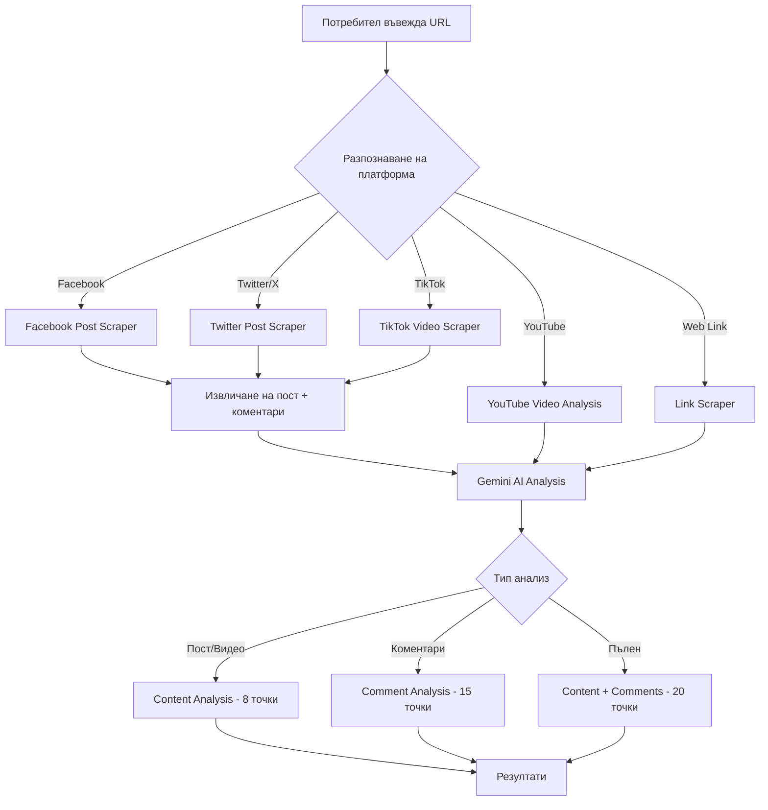

# FactChecker AI — Пълен план за действие

## Обща визия

Трансформиране на FactChecker AI от YouTube-only анализатор в **мулти-платформен AI одитор на информация** с поддръжка на YouTube, Facebook, Twitter/X, TikTok, уеб статии и анализ на коментари. Паралелно — поправка на всички критични бъгове и рефакториране в модулна архитектура.

---

## Нова файлова структура (след рефакториране)

```
H:/Apps/factcheckerAI/
├── server/
│   ├── index.js                    # Express app setup + listen
│   ├── middleware/
│   │   ├── auth.js                 # Token verification middleware
│   │   ├── rateLimiter.js          # Rate limiting per user
│   │   └── errorHandler.js         # Global error handler
│   ├── routes/
│   │   ├── gemini.js               # /api/gemini/* endpoints
│   │   ├── youtube.js              # /api/youtube/* endpoints
│   │   ├── linkScraper.js          # /api/link/* endpoints
│   │   ├── social.js               # /api/social/* (FB, Twitter, TikTok)
│   │   ├── checkout.js             # /api/lemonsqueezy/* endpoints
│   │   └── webhook.js              # /api/lemonsqueezy/webhook
│   ├── services/
│   │   ├── firebaseAdmin.js        # Firebase Admin SDK
│   │   ├── billingService.js       # Centralized billing logic
│   │   └── socialScrapers/
│   │       ├── facebookScraper.js
│   │       ├── twitterScraper.js
│   │       └── tiktokScraper.js
│   └── config/
│       └── pricing.js              # Single source of truth for pricing
│
├── src/
│   ├── index.tsx                   # Entry point
│   ├── AppRouter.tsx               # Routes
│   ├── types/
│   │   ├── analysis.ts             # VideoAnalysis, LinkAnalysis, SocialAnalysis
│   │   ├── billing.ts              # APIUsage, CostEstimate, Transaction
│   │   └── platform.ts             # Platform-specific types
│   ├── contexts/
│   │   └── AuthContext.tsx
│   ├── hooks/
│   │   ├── useAnalysis.ts          # Shared analysis logic
│   │   └── usePoints.ts            # Points balance management
│   ├── services/
│   │   ├── api/
│   │   │   ├── geminiClient.ts     # callGeminiAPI + callGeminiStreamAPI
│   │   │   ├── youtubeClient.ts    # YouTube metadata fetching
│   │   │   ├── linkClient.ts       # Link scraping client
│   │   │   └── socialClient.ts     # Social media API client
│   │   ├── analysis/
│   │   │   ├── videoAnalysis.ts    # YouTube-specific analysis flow
│   │   │   ├── linkAnalysis.ts     # Link/article analysis flow
│   │   │   ├── socialAnalysis.ts   # Social media analysis flow
│   │   │   └── commentAnalysis.ts  # Comment section analysis
│   │   ├── prompts/
│   │   │   ├── standardAnalysisPrompt.ts
│   │   │   ├── deepAnalysisPrompt.ts
│   │   │   ├── linkAnalysisPrompt.ts
│   │   │   ├── socialAnalysisPrompt.ts
│   │   │   ├── commentAnalysisPrompt.ts
│   │   │   └── reportSynthesisPrompt.ts
│   │   ├── transforms/
│   │   │   ├── jsonCleaner.ts      # cleanJsonResponse (extracted)
│   │   │   └── responseTransformer.ts # transformGeminiResponse
│   │   ├── pricing.ts
│   │   ├── validation.ts
│   │   └── firebase.ts
│   ├── components/
│   │   ├── common/
│   │   │   ├── Navbar.tsx
│   │   │   ├── MetricBlock.tsx     # Shared metric component
│   │   │   ├── ScannerAnimation.tsx
│   │   │   ├── LoadingPhases.tsx   # Shared loading UI
│   │   │   └── ErrorBanner.tsx     # Shared error display
│   │   ├── video/
│   │   │   ├── VideoAuditPage.tsx  # Main video analysis page
│   │   │   ├── VideoInput.tsx      # URL input + metadata preview
│   │   │   ├── ModeSelector.tsx    # Standard/Deep selector
│   │   │   ├── VideoResults.tsx    # Results container
│   │   │   ├── tabs/
│   │   │   │   ├── SummaryTab.tsx
│   │   │   │   ├── ClaimsTab.tsx
│   │   │   │   ├── ManipulationTab.tsx
│   │   │   │   ├── TranscriptTab.tsx
│   │   │   │   ├── DeepTabs.tsx    # Visual, Body, Vocal, etc.
│   │   │   │   └── ReportTab.tsx
│   │   │   └── ReliabilityChart.tsx
│   │   ├── linkAudit/
│   │   │   ├── LinkAuditPage.tsx
│   │   │   ├── LinkResults.tsx
│   │   │   └── ReliabilityGauge.tsx
│   │   ├── social/
│   │   │   ├── SocialAuditPage.tsx     # Main social analysis page
│   │   │   ├── PlatformSelector.tsx    # FB/Twitter/TikTok selector
│   │   │   ├── SocialResults.tsx
│   │   │   └── CommentAnalysis.tsx     # Comment section analysis
│   │   ├── archive/
│   │   │   └── ArchivePage.tsx         # Past analyses browser
│   │   ├── pricing/
│   │   │   └── PricingPage.tsx
│   │   ├── user/
│   │   │   ├── ExpensesPage.tsx
│   │   │   └── PointsWidget.tsx
│   │   └── auth/
│   │       ├── Login.tsx
│   │       ├── Register.tsx
│   │       └── ProtectedRoute.tsx
│   └── styles/
│       └── index.css
│
├── package.json
├── vite.config.ts
├── tsconfig.json
├── Dockerfile
└── .env.example
```

---

## ФАЗА 1: Критични поправки (Billing, Firestore, Webhook)

### 1.1 Унифициране на Firestore полето за точки
- **Проблем**: `firebaseAdmin.ts` чете `points`, `AuthContext.tsx` чете `pointsBalance`
- **Действие**: Стандартизиране на `pointsBalance` навсякъде
- **Файлове**: `server/services/firebaseAdmin.js`, `contexts/AuthContext.tsx`

### 1.2 Преместване на billing логиката на сървъра
- **Проблем**: Точките се приспадат от клиента — race condition
- **Действие**: Сървърът приспада точките СЛЕД успешна генерация, ПРЕДИ да върне резултата
- **Файлове**: `server/services/billingService.js`, `server/routes/gemini.js`
- **Логика**:
  1. Провери баланс >= estimated cost
  2. Генерирай анализ
  3. Изчисли реална цена
  4. Приспадни точки атомарно (Firestore transaction)
  5. Върни резултат + usage data на клиента
  6. Клиентът само обновява UI, НЕ приспада точки

### 1.3 Унифициране на ценовата логика
- **Проблем**: Pricing е дублиран в `server.js` (два пъти) и `pricing.ts`
- **Действие**: Единен `server/config/pricing.js` модул, импортиран навсякъде
- **Правила**:
  - **Standard Video**: x2 profit (EUR * 200 = points)
  - **Deep Video**: x3 profit (EUR * 200 * 1.5 = points)
  - **Link/Article**: Фиксирана такса **12 точки**
  - **Social Media Post**: Фиксирана такса **8 точки**
  - **Comment Analysis**: Фиксирана такса **15 точки** (per batch of 50 comments)
  - Минимум: Standard=5, Deep=10

### 1.4 Webhook идемпотентност
- **Проблем**: Повторен webhook = двойно зареждане на точки
- **Действие**: Записване на `orderId` в Firestore `processedOrders` колекция; проверка преди добавяне на точки
- **Файлове**: `server/routes/webhook.js`

### 1.5 Rate Limiting
- **Действие**: Добавяне на `express-rate-limit` middleware
- **Лимити**: 10 анализа/минута per user, 100 заявки/минута per IP
- **Файлове**: `server/middleware/rateLimiter.js`

---

## ФАЗА 2: Рефакториране в модулна архитектура

### 2.1 Разделяне на `server.js` (825 реда) на модули
- `server/routes/gemini.js` — `/api/gemini/generate`, `/api/gemini/generate-stream`, `/api/gemini/synthesize-report`
- `server/routes/youtube.js` — `/api/youtube/metadata`, proxy
- `server/routes/linkScraper.js` — `/api/link/scrape`
- `server/routes/checkout.js` — `/api/lemonsqueezy/checkout`
- `server/routes/webhook.js` — `/api/lemonsqueezy/webhook`
- `server/middleware/auth.js` — Token verification (извлечен от всеки endpoint)

### 2.2 Разделяне на `App.tsx` (853 реда) на компоненти
- `components/video/VideoAuditPage.tsx` — Основна страница за видео анализ
- `components/video/VideoInput.tsx` — URL input + metadata preview + mode selector
- `components/video/VideoResults.tsx` — Резултати с табове
- `components/video/tabs/*.tsx` — Отделен файл за всеки таб
- `components/common/MetricBlock.tsx` — Споделен компонент (премахване на дублирането)
- `components/common/LoadingPhases.tsx` — Споделен loading UI
- `components/common/ErrorBanner.tsx` — Споделен error display

### 2.3 Разделяне на `geminiService.ts` (953 реда) на модули
- `services/api/geminiClient.ts` — `callGeminiAPI`, `callGeminiStreamAPI`
- `services/transforms/jsonCleaner.ts` — `cleanJsonResponse`
- `services/transforms/responseTransformer.ts` — `transformGeminiResponse`
- `services/analysis/videoAnalysis.ts` — `analyzeYouTubeStandard`
- `services/analysis/linkAnalysis.ts` — Link-specific analysis

### 2.4 Разделяне на типовете
- `types/analysis.ts` — `VideoAnalysis`, `LinkAnalysis`, `SocialAnalysis`
- `types/billing.ts` — `APIUsage`, `CostEstimate`, `Transaction`
- `types/platform.ts` — Platform-specific types

---

## ФАЗА 3: UX поправки

### 3.1 Navbar поправки
- Премахване на дублирания бутон "Архив" (води към същия route като "Разходи")
- Добавяне на отделен "Архив" route за история на анализите
- Замяна на `window.location.href` с React Router navigation + state reset

### 3.2 Валидация в LinkAuditPage
- Използване на `validateNewsUrl()` преди стартиране на анализ
- Проверка на баланс >= 12 точки преди анализ

### 3.3 Проверка на баланс преди всяка операция
- Единна `usePoints` hook с `canAfford(cost)` метод
- Показване на ясно съобщение + линк към Pricing при недостатъчни точки

### 3.4 Подобрен loading experience
- Реален прогрес бар базиран на SSE streaming данни
- Показване на elapsed time + estimated remaining time

### 3.5 Responsive подобрения
- Тестване и поправка на мобилен изглед за всички нови компоненти
- Подобрен dropdown menu за мобилни устройства

---

## ФАЗА 4: Нови платформи + Анализ на коментари

### 4.1 Архитектура на Social Media анализ



### 4.2 Facebook анализ
- **Scraping**: Използване на Facebook oEmbed API за публични постове
- **Анализ на пост**: Текст, изображения, споделяния
- **Анализ на коментари**: Top 50 коментара — sentiment, manipulation, bot detection
- **Цена**: 8 точки за пост, 15 за коментари, 20 за пълен

### 4.3 Twitter/X анализ
- **Scraping**: Twitter API v2 (или Nitter fallback за публични туитове)
- **Анализ на туит**: Текст, медия, thread reconstruction
- **Анализ на коментари**: Top 50 replies — sentiment, bot detection, coordinated behavior
- **Цена**: 8 точки за туит, 15 за коментари, 20 за пълен

### 4.4 TikTok анализ
- **Scraping**: TikTok oEmbed API + video metadata
- **Анализ на видео**: Описание, хаштагове, аудио
- **Анализ на коментари**: Top 50 коментара — sentiment, manipulation
- **Цена**: 8 точки за видео, 15 за коментари, 20 за пълен

### 4.5 Comment Analysis промпт
Нов промпт `commentAnalysisPrompt.ts` който анализира:
- **Sentiment distribution**: Положителни/Отрицателни/Неутрални
- **Bot detection**: Повтарящи се фрази, нови акаунти, координирано поведение
- **Manipulation detection**: Astroturfing, brigading, concern trolling
- **Narrative analysis**: Доминиращи наративи в коментарите
- **Toxicity score**: Ниво на токсичност и hate speech
- **Influence mapping**: Кои коментари получават най-много engagement

### 4.6 Unified Social Audit Page
- Един input field с автоматично разпознаване на платформата
- Визуален индикатор за разпозната платформа (иконка + цвят)
- Toggle за "Анализирай и коментарите"
- Резултати адаптирани за всяка платформа

---

## ФАЗА 5: Обогатяване

### 5.1 Analysis Archive
- Нова Firestore колекция `analyses`
- Запис на всеки анализ с пълни резултати
- Страница `/archive` с:
  - Списък на минали анализи с thumbnail + дата + score
  - Филтриране по платформа, дата, score
  - Преглед на пълен анализ
  - Споделяне с публичен линк

### 5.2 Compare Mode
- Избиране на 2 анализа от архива
- Side-by-side сравнение на метрики
- Визуализация на разликите

### 5.3 PDF Export
- Замяна на html2canvas PNG export с професионален PDF
- Използване на `@react-pdf/renderer` или `jsPDF`
- Брандиран шаблон с лого, дата, QR код за верификация

### 5.4 Admin Dashboard (бъдещо)
- `/admin` route (protected by admin role)
- Статистики: анализи/ден, приходи, активни потребители
- Управление на потребители и точки
- Лог на грешки

### 5.5 Notification система
- In-app нотификации при завършен анализ
- Email нотификации (optional, чрез Firebase Functions)

---

## Ценова таблица (финална)

| Тип анализ | Цена |
|---|---|
| YouTube Standard | Динамична (x2 от Gemini cost, мин. 5 точки) |
| YouTube Deep | Динамична (x3 от Gemini cost, мин. 10 точки) |
| Link/Article | **12 точки** (фиксирана) |
| Social Media Post (FB/Twitter/TikTok) | **8 точки** (фиксирана) |
| Comment Analysis (50 коментара) | **15 точки** (фиксирана) |
| Full Social Audit (пост + коментари) | **20 точки** (фиксирана) |

---

## Ред на изпълнение

1. **Фаза 1** — Критични поправки (billing, Firestore, webhook, rate limiting)
2. **Фаза 2** — Рефакториране на файловата структура
3. **Фаза 3** — UX поправки
4. **Фаза 4** — Нови платформи + коментари
5. **Фаза 5** — Archive, Compare, PDF Export, Admin

Всяка фаза е независима и може да се deploy-не отделно.
